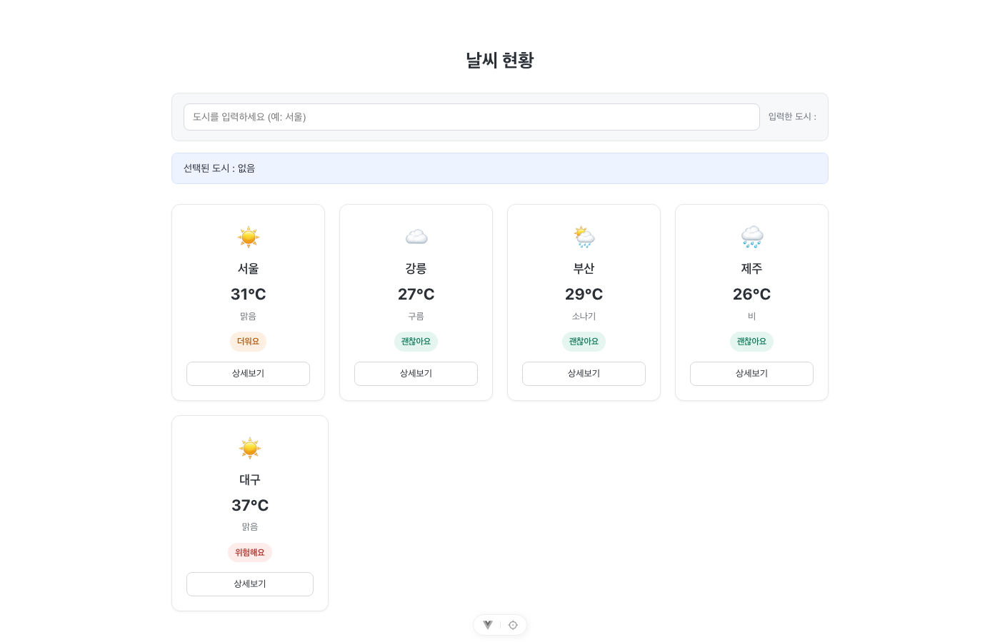
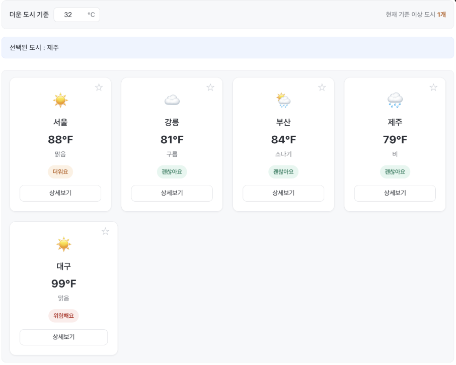

# Vue.js 과제 - Weather Dashboard

## 프로젝트 소개

SKALA Vue.js 수업의 Hands-on 과제를 누적하여 제작한 날씨 대시보드다.

처음에는 정적인 배열을 화면에 뿌리기만 하는 Mockup이었는데, 과제를 하나씩 거치면서 반응형 상태(Composition API) → 컴포넌트 분리(Props/Emits) → 페이지 라우팅(Vue Router) → 전역 상태 관리(Pinia) 순서로 같은 화면을 계속 다시 다듬어왔다.

배포 링크: [skala-vue-eta-five.vercel.app](https://skala-vue-eta-five.vercel.app/)

## 실행 방법

```bash
npm install
npm run dev
```

터미널에 출력되는 로컬 주소(기본값 `http://localhost:5173`)로 접속하면 된다.

## 주요 기능

- 기준 온도를 직접 입력해 "더운 도시" 개수 확인 (섭씨/화씨 단위 전환 반영)
- 도시 즐겨찾기 등록 및 "즐겨찾기만 보기" 필터 (Pinia `favoriteStore`)
- 대기질(PM10/PM2.5) 정보 및 Open-Meteo 기반 야외활동 지수 표시
- 대한민국 SVG 지도로 지역별 기온/대기질 시각화 및 지역 선택 패널
- API 상태(Loading/Error/Empty/404)를 한 화면에서 확인하는 "UI 상태" 페이지(`/states`)

## 단계별 구현 과정

<details>
<summary><h3>과제 1 - Weather Mockup</h3></summary>

### 목표

임의의 날씨 데이터 배열을 화면에 반복 출력하고, `v-for` / `v-if` / 이벤트 같은 기본 문법으로 정적인 대시보드 UI를 만드는 게 목표였다.



### 구현 내용

**1. 배열 렌더링**

`weatherList`에 여러 도시의 날씨 데이터를 저장하고 `v-for`로 카드를 반복 출력했다. 각 항목은 도시별 고유 `id`를 `:key`에 바인딩했다.

**2. 조건부 렌더링**

온도를 기준으로 4단계 상태를 표시했다.
34℃ 이상은 위험해요, 30℃ 이상은 더워요, 25℃ 이상은 괜찮아요, 그 미만은 선선해요.

**3. 한글 도시 입력**

`v-model` 대신 `:value`와 `@input`을 써서 한글 도시명을 입력받고 화면에 출력했다.

```vue
<input :value="searchCity" @input="(e) => (searchCity = e.target.value)" />
```

**4. 카드 선택 및 상세보기 이벤트**

카드를 클릭하면 도시명을 `selectedCity`에 저장해 화면에 표시했다. 카드 안의 상세보기 버튼에는 `@click.stop`을 붙여서 카드 클릭으로 이어지지 않게 했고, 버튼을 누르면 해당 도시의 습도를 alert로 띄웠다.

**5. 개인 데이터 추가**

기본 날씨 데이터에 `humidity`를 추가하고 상세보기 기능과 연결해서 실제로 쓰이도록 했다.

</details>

<details>
<summary><h3>과제 2 - Weather Composition</h3></summary>

### 목표

과제 1에서는 값을 그냥 변수로 두고 화면에 직접 썼는데, 이번에는 Composition API(`ref`, `computed`, `watch`, `watchEffect`)로 반응형 상태를 관리하고 검색 결과가 자동으로 다시 계산되도록 바꿨다.

### 구현 내용

**1. 반응형 상태와 computed 검색**

`searchQuery`, `selectedCityInfo`, `weatherList`를 `ref()`로 관리하고, 도시 이름에 검색어가 포함된 항목만 걸러내는 `filteredWeatherList`를 `computed`로 만들었다. Template에서는 원본 대신 `filteredWeatherList`를 `v-for`로 렌더링해서, 검색어가 바뀌면 목록이 자동으로 갱신된다.

**2. watch / watchEffect**

`watch(selectedCityInfo)`로 선택 도시가 바뀔 때 이전 값과 새 값을 콘솔에 찍고, `watchEffect`로는 `searchQuery`를 자동 추적해서 입력 중인 검색어를 로그로 남겼다.

**3. 검색 결과 표시**

검색어가 비었으면 전체 목록을, 일치하는 도시가 있으면 해당 도시만 보여준다. 결과가 0개일 때 띄우는 안내 문구는 목록 전체 상태를 판단해야 해서 `v-for` 바깥에 뒀다.

**4. 더운 도시 기준 온도 (개인 추가)**

`hotThreshold`(기본값 30) 이상인 도시 개수를 `hotCityCount`(`computed`)로 계산했다. 사용자가 기준 온도를 바꾸면 개수가 자동으로 다시 계산되고, `watch(hotThreshold)`로 변경 로그도 남긴다.

### Troubleshooting

**watch가 실행되지 않는 문제**

도시 카드를 눌러도 `watch(selectedCityInfo)`의 콘솔 로그가 안 찍혔다. `App.vue`가 아직 과제 1의 `WeatherMockup.vue`를 렌더링하고 있어서, 정작 수정 중이던 `WeatherComposition.vue`는 실행되지 않고 있었던 게 원인이다. `App.vue`의 import와 렌더링 대상을 바꿔서 해결했다. 로직이 멀쩡한데 동작을 안 하면 지금 실제로 렌더링되는 컴포넌트가 맞는지부터 확인해야 한다는 걸 알았다.

**검색 결과 없음 문구가 표시되지 않는 문제**

검색 결과가 0개인데도 안내 문구가 안 보였다. 문구용 `v-if`를 `v-for` 안쪽에 두면 배열이 비었을 때 `v-for`가 0번 돌아서 내부 `v-if`가 검사될 기회 자체가 없기 때문이다. `v-if`를 `v-for` 바깥으로 옮겨서 해결했다.

**배열과 개별 객체 혼동**

`hotCityCount`를 만들다가 `weatherList.value.temp`처럼 배열에서 바로 `temp`에 접근하려 했다. `temp`는 배열이 아니라 그 안의 각 객체에 있는 값이라 `filter((weather) => weather.temp >= hotThreshold.value)` 형태로 고쳤다. 비슷하게 `v-for`에 필터식을 직접 넣으려다가, 검색 결과 계산은 `computed`가 맡고 `v-for`는 계산된 결과만 렌더링하도록 역할을 나눴다.

</details>

<details>
<summary><h3>과제 3 - Weather Component</h3></summary>

### 목표

한 파일에 몰려 있던 상태·로직·화면을 여러 컴포넌트로 쪼개서 Props로 값을 내려주고 Emits로 이벤트를 올려받는 흐름을 연습했다. 기존 기능과 디자인은 그대로 두고 화면 단위만 나눴다.

### 구현 내용

**1. WeatherParents.vue — 상태와 로직은 부모에 유지**

`searchQuery`, `weatherList`, `hotThreshold`와 `filteredWeatherList` / `hotCityCount` 같은 계산 로직, watch/watchEffect는 전부 부모에 그대로 뒀다. 화면만 자식으로 나누고, 자식이 emit한 이벤트는 `handleUpdateQuery`, `handleSelectCard`, `handleClickDetail`, `handleUpdateThreshold`에서 받아 상태를 바꾼다.

**2. SearchBar.vue**

검색 input과 "입력한 도시" 표시 영역을 분리했다. 부모의 검색어를 `query` prop으로 받고, 입력이 생기면 `update-query` 이벤트로 새 값을 올려보낸다.

```vue
<SearchBar :query="searchQuery" @update-query="handleUpdateQuery" />
```

**3. WeatherCard.vue**

카드 한 장을 컴포넌트로 뺐다. 부모가 `v-for`를 돌면서 `weather` 객체를 통째로 Object Prop으로 넘기고, 카드 클릭은 `select-card`, 상세보기는 `click-detail`로 emit한다. 상세보기 버튼의 `@click.stop`과 온도별 상태 표시는 그대로 유지했다.

**4. BaseDashboardCard.vue**

검색 영역, 기준 온도 영역, 목록 영역이 공통으로 쓰는 카드형 레이아웃을 뺐다. 상태나 데이터는 다루지 않고 default slot으로 내부 콘텐츠만 렌더링한다. slot 안에 들어가는 컴포넌트들은 `BaseDashboardCard`가 아니라 부모 Template에서 작성되기 때문에 부모와 직접 Props/Emits로 연결된다.

**5. HotThresholdControl.vue**

"더운 도시 기준 온도" 기능을 별도 컴포넌트로 뺐다. 기준 온도와 도시 개수를 각각 Number prop으로 받아 표시하고, 값이 바뀌면 `update-threshold`로 emit한다.

**6. style scoped 분리**

한 파일에 몰려 있던 CSS를 각 컴포넌트가 책임지는 범위대로 나눠 옮겼다. 디자인 자체는 기존과 동일하게 뒀다.

### Troubleshooting

**분리 후 부모 상태에 직접 접근할 수 없던 문제**

전에는 한 파일에서 `searchQuery`를 바로 고쳤는데, `SearchBar`를 분리하고 나니 자식에서 부모 상태를 직접 바꿀 수 없었다. 현재 검색어는 `query` prop으로 내려주고 새 값은 `update-query` 이벤트로 올려보낸 뒤 부모가 갱신하는 구조로 해결했다.

**emit에 어떤 값을 넘겨야 하는지 혼동**

처음에는 `emit('update-query', props.query)`처럼 부모가 이미 내려준 값을 그대로 돌려보내려 했다. `props.query`는 현재 값일 뿐 방금 입력한 새 값이 아니어서, input 이벤트의 `$event.target.value`를 payload로 넘기도록 고쳤다.

**Props 전달 단위 결정**

`name`, `emoji`, `temp`, `status`를 각각 prop으로 나눌지 고민했는데, 데이터가 이미 도시 하나를 객체로 묶어 관리하고 있어서 `weather` 객체 하나를 통째로 넘기고 카드 안에서 필요한 값에 접근하도록 정리했다.

**v-for의 위치**

`WeatherCard`를 분리하면서 `v-for`도 자식으로 옮겨야 하는지 헷갈렸다. 목록을 갖고 있는 건 부모라서 `v-for`는 부모에 남기고, 반복되던 카드 마크업만 컴포넌트로 교체했다.

</details>

<details>
<summary><h3>과제 4 - Weather Router</h3></summary>

### 목표

여기까지는 화면 전환을 state로 처리했는데, 실제 URL(`/`, `/weather/:cityId`, `/about`)에 따라 화면이 바뀌도록 Vue Router를 도입했다. 한 파일에 몰려 있던 대시보드를 URL 단위 View로 나눴다.

### 구현 내용

**1. router/index.js**

`WeatherHomeView`, `WeatherAboutView`, `WeatherDetailView`, `NotFoundView` 네 라우트를 전부 동적 `import()`로 Lazy Loading 처리했다. 정의되지 않은 경로는 Catch-all Route로 `NotFoundView`에 연결했다.

```js
{
  path: '/:pathMatch(.*)*',
  name: 'not-found',
  component: () => import('../views/NotFoundView.vue'),
}
```

**2. App.vue**

`WeatherParents`를 직접 렌더링하던 자리를 `RouterLink` 내비게이션과 `RouterView`로 바꿨다. `WeatherParents.vue` 파일은 지우지 않고 더 이상 import하지 않는 상태로 남겨뒀다.

**3. WeatherHomeView.vue**

`WeatherParents.vue`의 상태와 로직을 그대로 옮겼다. 상세보기에서 `alert()`으로 습도를 띄우던 방식은 없애고 `useRouter()`로 상세 페이지에 이동하도록 바꿨다.

```js
const handleClickDetail = (cityId) => {
  router.push('/weather/' + cityId)
}
```

이 때문에 `WeatherCard.vue`가 `click-detail`로 emit하던 값도 `weather.humidity`에서 `weather.id`로 바꿨다. 화면에 보여줄 값과 라우팅에 필요한 식별자가 다르기 때문이다.

**4. WeatherDetailView.vue**

`useRoute()`로 URL의 `cityId`를 읽고, `onMounted` 시점에 일치하는 도시를 찾아 표시한다. 못 찾으면 "해당 도시 정보를 찾을 수 없습니다" 문구를 보여준다. Mock Data는 별도 파일로 빼지 않고 각 View에 인라인으로 뒀다.

**5. WeatherAboutView.vue / NotFoundView.vue**

About에는 소개 문구와 `/`로 돌아가는 링크를 넣었고, NotFound는 Catch-all Route에 연결해서 없는 경로로 들어오면 안내 문구와 돌아가기 링크를 보여준다.

### Troubleshooting

**emit 값을 humidity로 둔 채 라우팅한 문제**

`WeatherCard.vue`가 원래 습도를 emit하고 있었는데, 그 값을 그대로 두고 `router.push('/weather/' + ...)`를 호출하니 URL에 도시 `id` 대신 습도 숫자가 들어갔다. 그러면 상세 화면의 `find()`가 항상 실패해서 "찾을 수 없습니다" 문구만 떴다. emit 값을 `props.weather.id`로 바꿔서 해결했다.

</details>

<details>
<summary><h3>과제 5 - Weather Store</h3></summary>

### 목표

`WeatherHomeView`와 `WeatherDetailView`는 서로 다른 컴포넌트 인스턴스라 한쪽에 ref를 두면 다른 화면에서 그 값을 볼 수 없다. 두 화면이 같은 단위(섭씨/화씨) 설정을 공유해야 해서 Pinia로 전역 상태를 분리했다.

### 구현 내용

**1. configStore.js — 단위 설정 Store**

```js
export const useConfigStore = defineStore('config', {
  state: () => ({ unit: 'celsius' }),
  getters: {
    unitSymbol: (state) => (state.unit === 'celsius' ? '°C' : '°F'),
  },
  actions: {
    toggleUnit() {
      this.unit = this.unit === 'celsius' ? 'fahrenheit' : 'celsius'
    },
  },
})
```

**2. UnitToggler.vue**

`configStore.unitSymbol`을 버튼에 표시하고 클릭하면 `toggleUnit()`을 호출한다. 기존 Navigation Bar를 `.weather-topbar`로 감싸고 그 옆에 배치했다.

**3. 메인/상세 화면에 단위 적용**

`WeatherCard.vue`와 `WeatherDetailView.vue`에 각각 `displayTemp` computed를 두고, 원본 섭씨 데이터를 현재 단위에 맞게 변환해서 표시한다. 온도 조건 판정은 표시 단위와 상관없이 원본 섭씨 값 기준을 유지했다. 두 파일에 같은 변환 로직이 중복되는데 Composable로 줄일 수 있지만 이번 과제 범위에서는 그대로 뒀다.

**4. favoriteStore.js — 즐겨찾기 (개인 추가 Store)**

`favoriteIds` 배열에 즐겨찾기한 도시 `id`를 담고, `isFavorite(cityId)` getter와 `toggleFavorite(cityId)` action으로 관리한다. 카드와 상세 화면 우상단에 별 버튼을 추가했고, 카드 쪽 별 버튼에는 `@click.stop`을 붙여 카드 선택으로 번지지 않게 했다. Home에서 즐겨찾기한 도시가 Detail로 이동해도 유지되는데, 서로 다른 컴포넌트 인스턴스인데도 Store를 통해 상태를 공유하기 때문이다.

**5. "즐겨찾기만 보기" 필터**

`filteredWeatherList`가 검색어에 이어 즐겨찾기 여부까지 함께 걸러내도록 필터를 하나 더 붙였다.

### Troubleshooting

**즐겨찾기를 만들었지만 실제로는 아무 효과가 없던 문제**

Store와 별 버튼까지 만들고 보니, 버튼을 눌러도 별 색만 바뀔 뿐 그 상태를 쓰는 화면 요소가 하나도 없었다. 상태를 "쓰는" 로직만 만들고 "읽어서" 화면에 반영하는 쪽을 안 만들었던 게 원인이다. "즐겨찾기만 보기" 필터를 추가해서 `filteredWeatherList`가 `isFavorite`를 실제로 참조하도록 만들어 해결했다.

**"더운 도시 기준"이 화씨 모드에서도 섭씨로 동작하던 문제**



단위를 화씨로 바꾸면 카드 온도는 `°F`로 바뀌는데, "더운 도시 기준" 영역은 여전히 `°C`로 표시됐다. 단위 표기가 하드코딩돼 있었고, `hotCityCount`도 입력값을 항상 섭씨인 `weather.temp`와 그대로 비교하고 있었기 때문이다. 화씨 모드에서 32를 입력해도 실제로는 섭씨 32도 기준으로 판정되는 상태였다.

`unitSymbol`을 prop으로 내려주도록 바꾸고, 비교 로직도 화씨일 때만 섭씨로 환산한 뒤 비교하도록 고쳤다.

```js
const hotCityCount = computed(() => {
  const thresholdInCelsius =
    configStore.unit === 'fahrenheit' ? ((hotThreshold.value - 32) * 5) / 9 : hotThreshold.value
  return weatherList.value.filter((weather) => weather.temp >= thresholdInCelsius).length
})
```

단위를 토글해도 입력창에 이미 쓰여 있는 숫자 자체를 자동 환산하지는 않는다. 라벨과 판정 기준의 단위를 맞추는 것까지가 이번 수정 범위였다.

</details>

<details>
<summary><h3>과제 6 - Weather Axios</h3></summary>

### 목표

지금까지 컴포넌트 안에 인라인으로 박아둔 Mock 배열을 실제 API 데이터로 바꾸는 과제였다. 요구사항은 세 가지 — OpenWeatherMap으로 실제 날씨 가져오기, OpenWeatherMap의 다른 API를 추가해 기능 확장, 그리고 그 외 외부 API를 하나 더 붙여 기능 확장.

### 구현 내용

**1. weatherStore.js — Mock을 OpenWeatherMap 실데이터로 교체**

5개 도시 Mock 대신 전국 17개 시도의 좌표를 시드 데이터로 두고 Current Weather API를 불러온다. Home과 Detail이 같은 데이터를 봐야 하는 건 과제 5에서 Store를 나눴던 이유와 같아서 이번에도 Pinia로 관리했다.

```js
const responses = await Promise.all(
  sidoCoordinates.map((sido) =>
    axios.get('https://api.openweathermap.org/data/2.5/weather', {
      params: { lat: sido.lat, lon: sido.lng, appid: apiKey, units: 'metric', lang: 'kr' },
    }),
  ),
)
```

**2. Air Pollution API로 대기질 추가**

같은 API Key로 쓸 수 있는 Air Pollution API를 Current Weather와 나란히 병렬 호출해서 PM10/PM2.5/대기질 상태를 함께 가져왔다. OpenWeatherMap이 주는 `aqi`는 1~5단계인데, 바로 이해할 수 있게 "좋음/보통/나쁨/매우 나쁨" 4단계로 바꾸는 변환 함수를 따로 뒀다.

**3. Open-Meteo API로 야외활동 지수 계산**

세 번째 요구사항은 아래 Troubleshooting에 적은 이유로 AirKorea 대신 Open-Meteo를 썼다. 위도/경도를 콤마로 이어 붙여 요청 한 번으로 17개 시도의 기온/풍속/UV 지수를 받아온다.

```js
const response = await axios.get('https://api.open-meteo.com/v1/forecast', {
  params: {
    latitude: latitudes,
    longitude: longitudes,
    current: 'temperature_2m,wind_speed_10m',
    daily: 'uv_index_max',
    timezone: 'Asia/Seoul',
  },
})
```

받아온 값으로 0~100점짜리 "야외활동 지수"를 계산한다. 기온이 이상 범위(18~24도)를 벗어난 정도, UV 등급, 풍속 구간에 따라 100점에서 감점하는 방식이고, 계산 로직은 store 액션과 분리해 별도 함수로 뒀다.

### Troubleshooting

**테스트용 Axios 코드가 화면에 아예 안 뜨던 문제**

Axios 동작을 미리 확인해보려고 `AxiosWeather.vue`를 따로 만들었는데 화면에 아무것도 렌더링되지 않았다. `</template>` 태그 밖에 `<p>` 태그가 하나 남아 있던 게 원인이라, 그 태그를 template 안으로 옮기니 정상적으로 렌더링됐다.

**AirKorea 미세먼지 API를 시도했다가 Open-Meteo로 바꾼 과정**

요구사항 3을 채우려고 처음엔 공공데이터포털 AirKorea 대기오염 API를 붙였다. 확인한 사실은 다음과 같다.

- 서비스키 발급 문제를 해결한 뒤 curl로 직접 호출하면 정상 응답(200)이 왔다.
- 같은 요청을 브라우저에서 axios로 보내면 전부 403이 났다.
- Vite 개발 서버의 proxy를 거치면 dev 모드에서는 정상적으로 응답을 받을 수 있었다.

정확히 무엇 때문에 브라우저 요청만 차단되는지까지는 확인하지 못했다. 다만 이 프로젝트는 별도 백엔드 없이 Vercel로 정적 배포하기 때문에 dev proxy 방식은 배포 환경에서 그대로 쓸 수 없었다. 그래서 API Key 없이 호출할 수 있고 CORS를 허용하는 Open-Meteo API로 바꿨다.

</details>

<details>
<summary><h3>과제 7 - Weather UI Library</h3></summary>

### 목표

외부 UI Library를 하나 선정해서 자유롭게 적용하는 과제였다. 데이터 쪽은 과제 6에서 이미 충족한 상태라 건드리지 않고, Element Plus로 기존 화면의 UI를 다시 정리하는 데 집중했다.

### 구현 내용

**1. Element Plus 등록**

`element-plus`는 초기 스캐폴딩 단계부터 `package.json`에 있었지만 `main.js`에서 전역 등록을 한 적이 없어서 Weather 화면에서는 쓸 수 없는 상태였다. `app.use(ElementPlus)`로 등록해서 `el-*` 컴포넌트를 쓸 수 있게 했다.

**2. 화면별 적용**

상태/이벤트 흐름(Props/Emits, Pinia 연동)은 그대로 두고 마크업만 교체했다.

- `UnitToggler.vue`: 토글 버튼 → `el-switch`
- `HotThresholdControl.vue`: `input[type=number]` → `el-input-number`
- `SearchBar.vue`: `input` → `el-input`(clearable, prefix 아이콘)
- `WeatherHomeView.vue`: 로딩/에러/빈 상태 → `el-alert`, `el-empty`, 전체/즐겨찾기 필터 → `el-segmented`
- `WeatherCard.vue`, `WeatherDetailView.vue`, `WeatherAboutView.vue`: 상태·기술 스택 표시 → `el-tag`
- `NotFoundView.vue`: 404 화면 → `el-result`

**3. 맞지 않는 부분은 자체 구현**

목업과 비교했을 때 Element Plus 기본 스타일이 안 맞는 부분은 직접 만들었다. 대한민국 지도(`KoreaMap.vue`)는 지도/차트 라이브러리 없이 SVG `<path>`를 직접 그려서 지역 클릭·hover·색상 단계를 구현했고, 카드의 "상세보기"도 `el-button`의 박스 형태 대신 텍스트 링크로 만들었다.

**4. UI 상태 페이지 (`/states`) 추가**

Axios 연동 이후 마주치는 Success/Loading/Error/Empty/404 상태를 한 화면에서 확인할 수 있게 `UiStatesView.vue`를 만들었다. 디자인 샘플이 아니라 실제 `WeatherCard`, `el-skeleton`, `v-loading`, `el-alert`, `el-empty`를 그대로 쓰고, 404는 진짜 없는 경로로 이동해서 catch-all Route를 재사용한다.

### Troubleshooting

**검색 input이 카드 전체 폭까지 늘어나던 문제**

`el-input`에 `max-width`를 줬는데도 카드 폭까지 그대로 늘어났다. Element Plus가 `el-input`의 폭을 `--el-input-width`라는 자체 CSS 변수(기본값 100%)로 정하고 있었기 때문이다. `max-width` 대신 그 변수를 직접 420px로 지정해서 해결했다.

**대기질 범례 색상이 안 보이던 문제**

지도 범례의 색상 스와치(`<span>`)에 지도 `<path>`와 같은 클래스를 재사용했는데 색이 하나도 안 보였다. `fill`은 SVG 도형에만 적용되는 속성이라 일반 HTML 요소에는 효과가 없던 게 원인이다. 색상 값을 CSS 변수로 한 번만 정의하고 `<path>`에는 `fill`, `<span>`에는 `background-color`로 나눠 적용했다.

**지도 크기가 기온/대기질 모드마다 바뀌던 문제**

지도를 감싼 요소에 `width: min(480px, 100%)`를 줬는데도 모드를 오갈 때마다 크기가 달라졌다. 이 요소가 CSS Grid의 `auto` 트랙 안에 있었던 게 원인이다 — `auto` 트랙은 안쪽 콘텐츠 크기를 보고 폭이 정해지는데, 모드별로 범례 글자 길이가 달라서 트랙 폭까지 같이 흔들렸다. 요소의 `width`가 아니라 Grid 트랙 자체를 `grid-template-columns: 480px 1fr`로 고정해서 해결했다.

</details>

<details>
<summary><h3>과제 8 - Weather Deployment</h3></summary>

### 목표

소스 코드 품질을 정리(ESLint 에러 제거, API 키 환경 변수 처리)하고, 빌드한 정적 파일을 실제로 호스팅해서 확인하는 게 목표였다. 배포는 Vercel을 사용했다.

### 구현 내용

**1. ESLint 정리**

`npx eslint .`를 돌려보니 Weather 화면과 무관한 `components/code_challenge/`, `components/practices/`(과제를 진행하며 쌓인 실습용 컴포넌트, 어디서도 import하지 않는 상태)에서 `no-unused-vars` 에러가 여러 개 나왔다. 최종 제출 단계라 이 폴더들을 통째로 삭제했다. `HotThresholdControl.vue`와 `SearchBar.vue`에도 `const props = defineProps(...)`로 선언만 하고 참조하지 않는 미사용 변수 에러가 있었는데, `<script setup>`에서는 변수에 담지 않아도 Template에서 이름 그대로 쓸 수 있어서 `const props =` 부분만 지웠다. 최종적으로 0 error.

**2. API 키 환경 변수 처리**

`VITE_OPENWEATHER_API_KEY`는 `.env`에 두고 `import.meta.env`로 읽어오게 했고, `.env`는 `.gitignore`에 등록해 git에 올라가지 않도록 했다. `git ls-files`, `git log`로 히스토리에 키가 커밋된 적이 없는지도 확인했다.

**3. Build & Vercel 배포**

`npm run build`로 `dist/` 정적 파일을 만들고, GitHub 저장소를 Vercel에 연결해서 배포했다. → [skala-vue-eta-five.vercel.app](https://skala-vue-eta-five.vercel.app/)

### Troubleshooting

**배포 직후 "API 키를 확인해주세요" 에러만 뜨던 문제**

배포는 성공했는데 화면에는 날씨 데이터 대신 에러 문구만 떴다. Vercel은 GitHub 저장소만 보고 빌드하기 때문에, 로컬에만 있는 `.env`의 키를 전혀 모르는 상태였던 게 원인이다. Vercel 프로젝트 Settings의 Environment Variables에 같은 이름으로 키를 등록하고 Redeploy해서 해결했다. Vite는 환경 변수를 빌드 시점에 결과물에 넣기 때문에, 변수만 추가하고 재배포하지 않으면 이미 실패한 빌드가 그대로 남는다.

**API 키를 Secret으로 등록하려다 막힌 문제**

Vercel에서 환경 변수를 Secret으로 등록하려 하니 `Environment variables with a public framework prefix cannot use visibility: secret` 에러가 떴다. `VITE_` 접두사가 붙은 값은 빌드 결과물 JS에 그대로 들어가서 배포된 뒤에는 브라우저에서 확인할 수 있는 값이라, 대시보드에서만 조회를 막는 Secret 옵션은 의미가 없어 막혀 있었다. Config로 등록해서 해결했다. 백엔드 없이 프론트에서 직접 외부 API를 호출하는 구조에서는 키를 완전히 숨길 수 없고, 이번 요구사항인 "git에 키가 올라가지 않는 것"까지가 처리할 수 있는 범위였다.

</details>

## 회고

Vue를 배우면서 Spring Boot 작동 기제가 비슷하다고 생각했다. 하는 일은 완전히 다른데, 프레임워크가 깔아둔 판 위에서 규칙만 따라가면 일단 굴러간다는 감각이 비슷했다. 처음엔 ref, computed, Router, Pinia가 각자 따로 노는 기능들처럼 보였다. 실습을 반복하고 나서야 결국 전부 "상태를 어디에 두고, 어디로 옮길 것인가"라는 한 가지 질문에 붙은 도구라는 게 어느 정도 느껴졌다.

제일 오래 헤맨 건 Props & Emits였다. 부모에서 자식으로는 props, 자식에서 부모로는 emit이라는 설명 자체는 금방 이해했다. 문제는 실제 코드였는데, 이 값을 props로 내려야 하는지나 emit의 payload에 뭘 실어야 하는지에서 매번 멈췄다. 상세 페이지를 만들 때는 앞 단계에서 쓰던 emit 코드를 그대로 가져다 쓰는 바람에 URL에 도시 ID 대신 습도 값이 박히는 일도 있었다. 문법을 외우기보다, 지금 이 데이터가 어느 컴포넌트에 있고 어디까지 가야 하는지를 먼저 그려보는 연습이 필요하겠다.

반대로 좋았던 건 하나의 화면을 단계적으로 고쳐나갔다는 점이다. 처음엔 한 컴포넌트 안에서 데이터를 전부 들고 있었고, 이후에 Component 분리 → Router → Pinia → Axios를 순서대로 붙이면서 역할이 조금씩 쪼개졌다. 특히 Pinia는 "여러 화면에서 같은 상태를 봐야 한다"는 상황을 직접 겪은 뒤에 넣었기 때문에, Store 사용법을 먼저 읽었을 때보다 훨씬 잘 들어왔다.

콘솔 로그를 어디에 찍을지도 이번에 꽤 고민했다. 처음엔 값이 바뀌는 걸 확인하려고 watch, watchEffect, 이벤트 핸들러마다 로그를 넣었는데, 이벤트 하나 발생할 때마다 콘솔이 밀려 올라가서 정작 보고 싶은 값을 찾기가 어려웠다. 그렇다고 다 지우면 문제가 생겼을 때 어느 단계에서 값이 틀어졌는지 알 수 없다. 마지막에 Codex로 리팩토링 피드백을 받아보면서 이 부분도 같이 봤는데, 실제 코드에 반영하진 않았지만 로그는 많이 남기는 게 아니라 "어떤 상태 변화 또는 어떤 실패 지점을 보려는 로그인지"를 정하고 남겨야 한다는 쪽으로 생각이 정리됐다.

아쉬운 건 기능 구현에 쏠려서, 앞에서 짠 코드가 뒷 단계에서 어떤 역할로 바뀌었는지 정리하고 넘어가지 못했다는 점이다. 컴포넌트를 분리하거나 Store를 도입할 때도 일단 동작하게 만드는 게 우선이었고, 왜 이 상태가 부모에 있어야 하는지, 왜 Store로 올려야 하는지는 한참 뒤에 다시 들여다보는 식이었다. 다음 프로젝트에서는 기능이 돌아간 시점에 데이터 흐름과 파일별 책임을 한 번 훑고 넘어가려고 한다.

API 연동과 Vercel 배포까지 해보면서, 로컬에서 잘 도는 것과 배포 환경에서 잘 도는 건 완전히 별개의 문제라는 것도 알게 됐다. 브라우저 요청에서 튄 403, 환경변수가 Vercel에 전달되지 않아 API 호출이 통째로 실패한 문제 모두 코드만 봐서는 원인을 찾을 수 없는 것들이었다. 서비스를 볼 때 실행 환경까지 같이 봐야 한다는 걸 여기서 배웠다.

정리하면 이번 실습은 Vue 문법보다 상태 관리 → 컴포넌트 간 데이터 전달 → 라우팅 → 전역 상태 → API 연동 → 배포로 이어지는 흐름을 한 번 통과해본 경험에 가까웠다. Props & Emits처럼 다시 봐야 할 부분은 남아 있지만, 다음에 Vue 프로젝트를 처음부터 짠다면 각 기능을 왜 쓰는지 정도는 미리 정하고 구조를 잡을 수 있을 것 같다.
